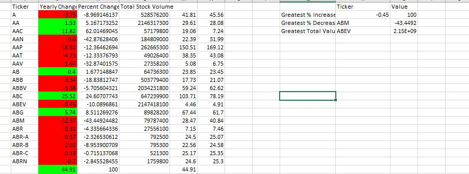

# VBA-Challenge-1

* Created a script that will loop through all the stocks for one year for each run and take the following information.

  * The ticker symbol.

  * Yearly change from opening price at the beginning of a given year to the closing price at the end of that year.

  * The percent change from opening price at the beginning of a given year to the closing price at the end of that year.

  * The total stock volume of the stock.

* Conditional formatting  highlights positive change in green and negative change in red.

# Screenshots

Screenshot of output after running code. Shows the tickers and values associated with the greatest percent increase, greatest precent decrease, and greatest total value change over the course of a year along with their values.
